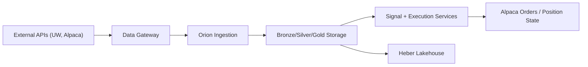

# Architecture

## Overview

Orion is a service-oriented backend for ingestion, signal generation, and execution workflows.
It is currently being aligned to a migration where:
- Data access is routed through Data Gateway.
- Durable storage and historical query paths move to Heber.

## System Components

- `src/orion/ingestion/` and `src/orion/ingestion/__main__.py`
  - Pulls market/provider events and normalizes payloads.
- `src/orion/processing/`
  - Feature computation and rule/signal transformations.
- `src/orion/core/`
  - Shared business logic, solver orchestration, risk rules, and promotion logic.
- `src/orion/execution/` and `src/orion/main_execution.py`
  - Preflight checks, risk checks, and order submission paths.
- `src/orion/api/main.py`
  - Operational/admin FastAPI endpoints.
- `src/orion/storage/`
  - SQLAlchemy models for Bronze/Silver/Gold and operational state.

## Data Flow

1. Providers and gateway feeds are ingested.
2. Raw events are persisted (Bronze).
3. Normalized records are materialized (Silver).
4. Enriched rollups/features/candidates are produced (Gold).
5. Execution loop evaluates candidates with safety gates.
6. Metrics, logs, and audits are emitted for observability.

## Key Design Decisions

- Keep core domain logic in `core/` and feature slices, not inside API handlers.
- Keep paper mode as default execution posture.
- Use structured logging (`structlog`) for machine-readable operations telemetry.
- Preserve deterministic IDs and idempotent write patterns for replay safety.

## External Integrations

- Data Gateway: data access proxy and polling coordination.
- Heber: lakehouse storage and historical query source.
- Alpaca: market/trading integration.
- Unusual Whales: options flow and alerts sources.
- Shared MCP server: expanded external tool access.

## Diagrams

Related docs:
- `/Users/jacobmcmillan/Empire/Orion/PRD.md`
- `/Users/jacobmcmillan/Empire/Orion/docs/RUNBOOK.md`
- `/Users/jacobmcmillan/Empire/Orion/docs/API_REFERENCE.md`
- `/Users/jacobmcmillan/Empire/Orion/docs/DATA_CONTRACTS.md`
