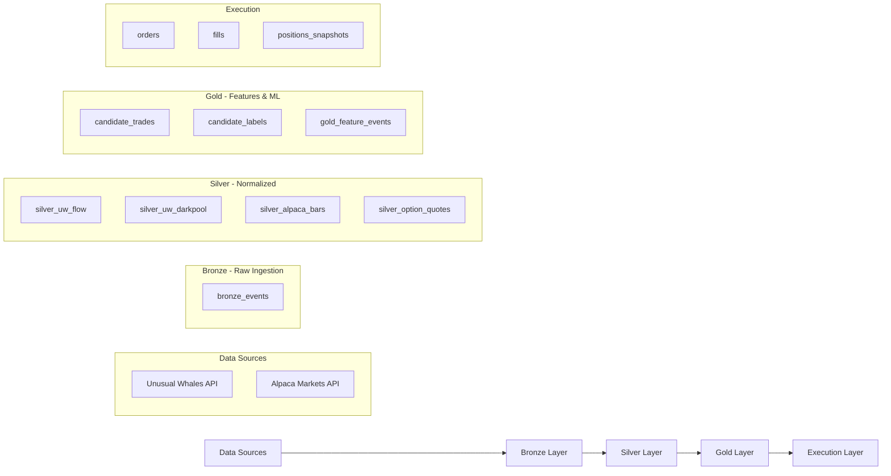

# Orion Database Schema Reference

> **Last Updated**: January 2026  
> **Database**: PostgreSQL with TimescaleDB + pgvector extensions

The Orion database follows a **Medallion Architecture** (Bronze → Silver → Gold) for data quality and lineage tracking.

---

## Architecture Overview



---

## Layer Summary

| Layer | Purpose | Table Count | Key Tables |
|:------|:--------|:-----------:|:-----------|
| **Bronze** | Raw ingestion, immutable | 3 | `bronze_events`, `system_status`, `ingest_watermarks` |
| **Silver (Market)** | Normalized OHLCV | 2 | `silver_alpaca_bars`, `silver_option_quotes` |
| **Silver (Flow)** | Options flow data | 3 | `silver_uw_flow`, `silver_uw_darkpool`, `silver_uw_alerts` |
| **Gold** | ML features & labels | 6 | `candidate_trades`, `candidate_labels`, `gold_feature_events` |
| **Execution** | Order management | 3 | `orders`, `fills`, `positions_snapshots` |
| **ML** | Model registry | 3 | `ml_models`, `ml_dataset_snapshots`, `ml_feature_registry` |
| **System** | Infrastructure | 3 | `instrument_symbology`, `audit_events`, `dead_letter_queue` |

---

## Bronze Layer (Raw Ingestion)

### `bronze_events`

The **immutable raw event store**. All ingested data is stored here exactly as received from sources before any transformation.

| Column | Type | Description |
|:-------|:-----|:------------|
| `event_id` | String (PK) | Deterministic unique identifier |
| `source` | String | Data provider: `UW` (Unusual Whales) or `ALPACA` |
| `source_event_id` | String | Original ID from the source system |
| `event_type` | String | Event classification (see table below) |
| `ticker` | String (indexed) | Stock/option symbol |
| `trading_date` | Date | Trading date |
| `session` | String | Market session: `regular`, `extended` |
| `schema_version` | String | Schema version (default: `v1`) |
| `event_ts_utc` | DateTime (indexed) | When the event occurred at source |
| `received_ts_utc` | DateTime | When Orion received the event |
| **`payload`** | **JSON** | **Raw, unmodified data from source** |
| **`ingest`** | **JSON** | **Ingestion metadata (run_id, trace_id)** |

**Event Types:**

| Source | Event Type | Description |
|:-------|:-----------|:------------|
| `UW` | `UW_FLOW` | Options flow transaction |
| `UW` | `UW_DARKPOOL` | Dark pool trade |
| `UW` | `UW_ALERT` | Flow alert signal |
| `ALPACA` | `ALPACA_BAR_1M` | 1-minute OHLCV bar |

---

### `ingest_watermarks`

Tracks the last processed timestamp for each data source to enable incremental ingestion.

| Column | Type | Description |
|:-------|:-----|:------------|
| `key` | String (PK) | Watermark identifier (e.g., `UW_FLOW_LAST_TS`) |
| `last_seen_ts_utc` | DateTime | Last processed event timestamp |
| `updated_ts_utc` | DateTime | When watermark was updated |

---

## Silver Layer (Normalized Data)

### `silver_uw_flow`

Normalized options flow events from Unusual Whales.

| Column | Type | Description |
|:-------|:-----|:------------|
| `event_id` | String (PK) | Event identifier |
| `ticker` | String (indexed) | Underlying symbol |
| `flow_ts_utc` | DateTime (indexed) | Flow timestamp |
| `put_call` | String(1) | `C` (Call) or `P` (Put) |
| `expiry` | String | Expiration date (YYYY-MM-DD) |
| `strike` | Float | Strike price |
| `option_price` | Float | Contract price |
| `size_contracts` | Integer | Number of contracts |
| `premium_usd` | Float | Total premium |
| `bid` | Float | Bid price |
| `ask` | Float | Ask price |
| `underlying_price` | Float | Stock price at time of trade |
| `aggressor` | String | `ASK`, `BID`, or `MID` |
| `is_sweep` | Boolean | Sweep trade indicator |
| `iv` | Float | Implied volatility |
| `volume_oi_ratio` | Float | Volume / Open Interest |
| `delta_alpaca` | Float | Delta (from Alpaca) |
| `gamma_alpaca` | Float | Gamma (from Alpaca) |
| `theta_alpaca` | Float | Theta (from Alpaca) |
| `vega_alpaca` | Float | Vega (from Alpaca) |
| `ingest` | JSON | Ingestion metadata |

---

### `silver_uw_darkpool`

Dark pool trade data from Unusual Whales.

| Column | Type | Description |
|:-------|:-----|:------------|
| `event_id` | String (PK) | Event identifier |
| `ticker` | String (indexed) | Symbol |
| `dark_ts_utc` | DateTime (indexed) | Trade timestamp |
| `trade_price` | Float | Execution price |
| `size_shares` | Float | Share volume |
| `venue` | String | Dark pool venue |
| `conditions` | String | Trade conditions |

---

### `silver_alpaca_bars`

1-minute OHLCV bars from Alpaca Markets.

| Column | Type | Description |
|:-------|:-----|:------------|
| `ticker` | String (PK) | Symbol |
| `bar_start_ts_utc` | DateTime (PK) | Bar start time |
| `open` | Float | Open price |
| `high` | Float | High price |
| `low` | Float | Low price |
| `close` | Float | Close price |
| `volume` | Float | Volume |
| `vwap` | Float | Volume-weighted average price |

---

### `silver_option_quotes`

Real option quotes captured at checkpoint intervals for ML labeling.

| Column | Type | Description |
|:-------|:-----|:------------|
| `id` | Integer (PK) | Auto-increment ID |
| `option_symbol` | String (indexed) | OCC symbol |
| `underlying_ticker` | String (indexed) | Underlying stock |
| `flow_event_id` | String (indexed) | Links to flow event |
| `checkpoint` | String | Time checkpoint: `entry`, `15m`, `30m`, `1h` |
| `ts_utc` | DateTime | Quote timestamp |
| `bid_price` | Float | Bid |
| `ask_price` | Float | Ask |
| `mid_price` | Float | Mid |
| `delta` | Float | Delta at checkpoint |
| `gamma` | Float | Gamma at checkpoint |
| `theta` | Float | Theta at checkpoint |
| `vega` | Float | Vega at checkpoint |
| `iv` | Float | Implied volatility |

---

## Gold Layer (Features & ML)

### `candidate_trades`

Trade candidates identified by rules or ML models.

| Column | Type | Description |
|:-------|:-----|:------------|
| `candidate_id` | String (PK) | Deterministic ID: `sha256(ticker + ts + rule_id)` |
| `ticker` | String (indexed) | Symbol |
| `timestamp_utc` | DateTime (indexed) | Signal timestamp |
| `rule_id` | String (indexed) | Rule that generated candidate |
| `direction` | String | `LONG` or `SHORT` |
| `confidence` | Float | Confidence score (0.0 - 1.0) |
| `source` | String | Signal source (`UW`, `ALPACA`) |
| `option_symbol` | String (indexed) | OCC format symbol |
| `strike_price` | Float | Strike price |
| `expiration_date` | DateTime | Option expiration |
| `option_type` | String | `CALL` or `PUT` |
| `underlying_price` | Float | Stock price at signal |
| `premium` | Float | Contract premium |
| `execution_params` | JSON | Limit price, TIF, etc. |
| `evidence` | JSON | Pointers to signal/event IDs |

---

### `exit_decisions`

Exit decisions triggered by exit rules.

| Column | Type | Description |
|:-------|:-----|:------------|
| `exit_id` | String (PK) | Exit decision ID |
| `ticker` | String (indexed) | Symbol |
| `candidate_id` | String (indexed) | Links to entry candidate |
| `rule_id` | String | Exit rule that triggered |
| `exit_reason` | String | Reason for exit |
| `urgency` | String | `IMMEDIATE`, `SOON`, `CONSIDER` |
| `confidence` | Float | Confidence score |
| `details` | JSON | Additional context |
| `broker_order_id` | String | Broker order ID |
| `exit_ts_utc` | DateTime | Exit timestamp |
| `exit_price` | Float | Exit price |
| `entry_price` | Float | Original entry price |
| `pnl_usd` | Float | Realized P&L (USD) |
| `pnl_pct` | Float | Realized P&L (%) |

---

### `strategy_decisions`

Final strategy decisions on whether to execute candidates.

| Column | Type | Description |
|:-------|:-----|:------------|
| `decision_id` | String (PK) | Decision ID |
| `candidate_id` | String (indexed) | Links to candidate_trades |
| `timestamp_utc` | DateTime | Decision timestamp |
| `ticker` | String | Symbol |
| `strategy_version_id` | String | Strategy version |
| `model_version` | String | ML model version |
| `decision` | String | `EXECUTE` or `SKIP` |
| `p_take` | Float | Probability of success |
| `execution_params` | JSON | Limit price, TIF, etc. |
| `reason` | String | Explanation |
| `executed_successfully` | String | `TRUE`, `FALSE`, `SKIPPED`, `PENDING` |
| `decision_trace_json` | JSON | Full decision trace |

---

### `gold_ticker_rollup`

Aggregated OHLCV bars at multiple timeframes (5m, 1h, 1d).

| Column | Type | Description |
|:-------|:-----|:------------|
| `ticker` | String (PK) | Symbol |
| `period` | String (PK) | Timeframe: `5m`, `1h`, `1d` |
| `timestamp_utc` | DateTime (PK) | Bar timestamp |
| `open` | Float | Open price |
| `high` | Float | High price |
| `low` | Float | Low price |
| `close` | Float | Close price |
| `volume` | Float | Volume |
| `vwap` | Float | VWAP |

---

## Labels Tables

### `candidate_labels`

Triple-barrier labels for ML training (trade-level).

| Column | Type | Description |
|:-------|:-----|:------------|
| `candidate_id` | String (PK) | Links to candidate_trades |
| `label` | Float | `1` (profit target), `-1` (stop loss), `0` (time exit) |
| `ret` | Float | Return at barrier |
| `barrier_hit_ts` | DateTime | When barrier was hit |
| `time_to_hit_seconds` | Float | Time to barrier |
| `mfe` | Float | Maximum favorable excursion |
| `mae` | Float | Maximum adverse excursion |

---

### `labels_event`

Event-level labels with forward returns at multiple horizons.

| Column | Type | Description |
|:-------|:-----|:------------|
| `candidate_id` | String (PK) | Links to candidate |
| `ticker` | String (indexed) | Symbol |
| `event_ts_utc` | DateTime (indexed) | Event timestamp |
| `forward_returns` | JSON | Returns at horizons: `{"1m": 0.02, "5m": 0.03, "60m": 0.01}` |
| `label` | Float | Triple-barrier label |
| `ret` | Float | Return at barrier |
| `barrier_hit_ts` | DateTime | Barrier hit time |
| `time_to_hit_seconds` | Float | Time to barrier |
| `mfe` | Float | Maximum favorable excursion |
| `mae` | Float | Maximum adverse excursion |
| `label_config` | JSON | Labeling parameters |

---

### `labels_window`

Window-level labels for aggregated timeframes.

| Column | Type | Description |
|:-------|:-----|:------------|
| `ticker` | String (PK) | Symbol |
| `period` | String (PK) | Timeframe: `5m`, `1h`, `1d` |
| `window_end_ts_utc` | DateTime (PK) | Window end timestamp |
| `forward_returns` | JSON | Forward returns at horizons |
| `label_config` | JSON | Labeling parameters |

---

## Feature Tables

### `gold_feature_events`

Point-in-time feature vectors (event-level, 1m resolution).

| Column | Type | Description |
|:-------|:-----|:------------|
| `ticker` | String (PK) | Symbol |
| `event_ts_utc` | DateTime (PK) | Feature timestamp |
| `feature_set_id` | String (PK) | Feature version (e.g., `v1_legacy`) |
| `features` | JSON | Feature vector |

---

### `gold_feature_windows`

Aggregated/window-level features.

| Column | Type | Description |
|:-------|:-----|:------------|
| `ticker` | String (PK) | Symbol |
| `window_end_ts_utc` | DateTime (PK) | Window end timestamp |
| `period` | String (PK) | Timeframe: `5m`, `1h` |
| `feature_set_id` | String (PK) | Feature version |
| `features` | JSON | Feature vector |

---

## Execution Layer

### `orders`

Order records submitted to broker.

| Column | Type | Description |
|:-------|:-----|:------------|
| `id` | String (PK) | Internal order ID |
| `decision_id` | String (indexed) | Links to strategy_decisions |
| `candidate_id` | String (indexed) | Links to candidate_trades |
| `ticker` | String (indexed) | Symbol |
| `side` | String | `buy` or `sell` |
| `qty` | Float | Quantity |
| `limit_price` | Float | Limit price (if applicable) |
| `client_order_id` | String (indexed) | Client-assigned order ID |
| `broker_order_id` | String (indexed) | Broker-assigned order ID |
| `status` | String | Order status |
| `error_message` | String | Error details (if any) |
| `raw_json` | JSON | Full broker response |

---

### `fills`

Execution fills from broker.

| Column | Type | Description |
|:-------|:-----|:------------|
| `id` | String (PK) | Fill ID |
| `ticker` | String (indexed) | Symbol |
| `broker_order_id` | String (indexed, unique) | Broker order ID |
| `filled_qty` | Float | Filled quantity |
| `filled_avg_price` | Float | Average fill price |
| `side` | String | `buy` or `sell` |
| `filled_at_utc` | DateTime | Fill timestamp |
| `raw_json` | JSON | Full broker response |

---

### `positions_snapshots`

Point-in-time position snapshots for P&L tracking.

| Column | Type | Description |
|:-------|:-----|:------------|
| `id` | String (PK) | Snapshot ID |
| `snapshot_ts_utc` | DateTime (indexed) | Snapshot timestamp |
| `ticker` | String (indexed) | Symbol |
| `qty` | Float | Position quantity |
| `avg_entry_price` | Float | Average entry price |
| `market_value` | Float | Current market value |
| `unrealized_pl` | Float | Unrealized P&L |
| `raw_json` | JSON | Full position data |

---

### `silver_signals`

Calculated technical features derived from 1-minute bars.

| Column | Type | Description |
|:-------|:-----|:------------|
| `signal_id` | String (PK) | Deterministic ID |
| `ticker` | String (indexed) | Symbol |
| `signal_ts_utc` | DateTime (indexed) | Signal timestamp |
| `signal_type` | String | `OHLCV_1M`, `FLOW_AGG_5M` |
| `features` | JSON | Calculated features (RSI, VWAP, trend, etc.) |

---

## ML Tables

### `ml_pattern_insights`

Weekly ML pattern mining results for model introspection.

| Column | Type | Description |
|:-------|:-----|:------------|
| `insight_id` | String (PK) | Insight ID |
| `model_type` | String (indexed) | `hit_target_50`, `avoid_stop` |
| `model_version` | String | Model version |
| `training_window_days` | Integer | Training window (default: 30) |
| `sample_size` | Integer | Training sample size |
| `positive_rate` | Float | Positive class rate |
| `train_auc` | Float | Training AUC |
| `holdout_auc` | Float | Holdout AUC |
| `precision_at_50` | Float | Precision at 50% recall |
| `top_rules_json` | JSON | Extracted decision rules |
| `top_features_json` | JSON | Top feature importances |
| `degraded_features_json` | JSON | Features showing drift |
| `emerging_patterns_json` | JSON | New patterns detected |
| `metadata_json` | JSON | Full metadata |

---

### `ml_feature_importance_history`

Feature importance tracking over time for drift detection.

| Column | Type | Description |
|:-------|:-----|:------------|
| `id` | String (PK) | Record ID |
| `model_type` | String (indexed) | Model type |
| `feature_name` | String (indexed) | Feature name |
| `importance` | Float | Importance score |
| `rank` | Integer | Feature rank |

---

## Database Features

- **TimescaleDB**: Hypertable optimization for time-series queries
- **pgvector**: 768-dimensional embeddings in `vector_documents`
- **Immutable Audit**: `audit_events` uses hash chain for tamper-evidence

---

## Model Files Location

All SQLAlchemy models are defined in:

```
src/orion/storage/
├── models.py           # Bronze layer (BronzeEvent, SystemStatus, IngestWatermark)
├── models_silver.py    # Silver layer tables
├── models_gold.py      # Gold layer tables
├── models_execution.py # Execution layer tables
├── models_ml.py        # ML registry tables
├── models_audit.py     # Audit events
├── models_dlq.py       # Dead letter queue
├── models_earnings.py  # Earnings data
├── models_risk.py      # Risk management
├── models_signals.py   # Signal tables
└── models_solvers.py   # Solver optimization
```
