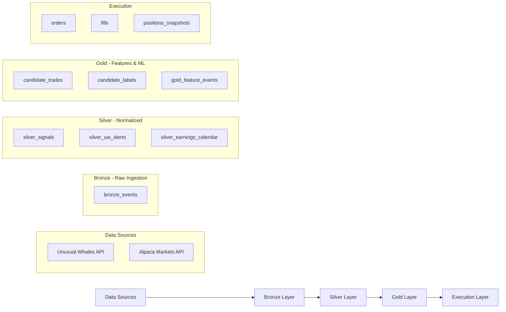

# Orion Database Schema Reference

> **Last Updated**: March 2026
> **Database**: PostgreSQL with TimescaleDB + pgvector extensions

The Orion database follows a **Medallion Architecture** (Bronze -> Silver -> Gold) for data quality and lineage tracking.

---

## Architecture Overview



---

## Layer Summary

| Layer | Purpose | Table Count | Key Tables |
|:------|:--------|:-----------:|:-----------|
| **Bronze** | Raw ingestion, immutable | 1 | `bronze_events` |
| **Silver** | Normalized signals & alerts | 3 | `silver_signals`, `silver_uw_alerts`, `silver_earnings_calendar` |
| **Gold** | Candidates, labels, features, rollups | 6 | `candidate_trades`, `candidate_labels`, `gold_feature_events` |
| **Execution** | Order management | 3 | `orders`, `fills`, `positions_snapshots` |
| **Signals** | Live executable signals | 1 | `signals_live` |
| **ML** | Pattern insights & predictions | 3 | `ml_pattern_insights`, `ml_feature_importance_history`, `ml_predictions` |
| **RAG** | Vector search | 1 | `vector_documents` |
| **Solvers** | Strategy optimization | 6 | `solvers`, `meta_experiments`, `solver_metrics`, `solver_runs`, `solver_edits`, `promotion_recommendations` |
| **Risk** | Risk state tracking | 2 | `risk_state`, `processed_fills` |
| **Trade Journal** | Trade lifecycle records | 1 | `trade_journal_entries` |
| **System** | Infrastructure & audit | 5 | `system_status`, `ingest_watermarks`, `job_cursor_state`, `runtime_config`, `audit_logs` |
| **DLQ** | Error handling | 1 | `dead_letter_queue` |

---

## Bronze Layer (Raw Ingestion)

### `bronze_events`

The **immutable raw event store**. All ingested data is stored here exactly as received from sources before any transformation.

| Column | Type | Description |
|:-------|:-----|:------------|
| `event_id` | String (PK) | Deterministic unique identifier |
| `source` | String | Data provider: `UW` (Unusual Whales) or `ALPACA` |
| `source_event_id` | String | Original ID from the source system |
| `event_type` | String | Event classification (see table below) |
| `ticker` | String (indexed) | Stock/option symbol |
| `trading_date` | Date | Trading date |
| `session` | String | Market session: `regular`, `extended` |
| `schema_version` | String | Schema version (default: `v1`) |
| `event_ts_utc` | DateTime (indexed) | When the event occurred at source |
| `received_ts_utc` | DateTime | When Orion received the event |
| **`payload`** | **JSON** | **Raw, unmodified data from source** |
| **`ingest`** | **JSON** | **Ingestion metadata (run_id, trace_id)** |

**Event Types:**

| Source | Event Type | Description |
|:-------|:-----------|:------------|
| `UW` | `UW_FLOW` | Options flow transaction |
| `UW` | `UW_DARKPOOL` | Dark pool trade |
| `UW` | `UW_ALERT` | Flow alert signal |
| `ALPACA` | `ALPACA_BAR_1M` | 1-minute OHLCV bar |

---

### `ingest_watermarks`

Tracks the last processed timestamp for each data source to enable incremental ingestion.

| Column | Type | Description |
|:-------|:-----|:------------|
| `key` | String (PK) | Watermark identifier (e.g., `UW_FLOW_LAST_TS`) |
| `last_seen_ts_utc` | DateTime | Last processed event timestamp |
| `updated_ts_utc` | DateTime | When watermark was updated |

---

## Silver Layer (Normalized Data)

### `silver_signals`

Calculated technical features derived from 1-minute bars.

| Column | Type | Description |
|:-------|:-----|:------------|
| `signal_id` | String (PK) | Deterministic ID |
| `ticker` | String (indexed) | Symbol |
| `signal_ts_utc` | DateTime (indexed) | Signal timestamp |
| `signal_type` | String | `OHLCV_1M`, `FLOW_AGG_5M` |
| `features` | JSON | Calculated features (RSI, VWAP, trend, etc.) |

---

### `silver_uw_alerts`

Normalized UW flow alerts.

| Column | Type | Description |
|:-------|:-----|:------------|
| `event_id` | String (PK) | Event identifier |
| `source_event_id` | String | Source event ID |
| `ticker` | String (indexed) | Symbol |
| `alert_ts_utc` | DateTime (indexed) | Alert timestamp |
| `put_call` | String(1) | `C` (Call) or `P` (Put) |
| `expiry` | String | Expiration date |
| `strike` | Float | Strike price |
| `option_price` | Float | Contract price |
| `size_contracts` | Integer | Number of contracts |
| `premium_usd` | Float | Total premium |
| `volume_contract` | Float | Volume |
| `open_interest` | Float | Open interest |
| `flags_json` | JSON | Alert flags |
| `alert_tags` | JSON | Alert tags |
| `ingest` | JSON | Ingestion metadata |

---

### `silver_earnings_calendar`

Earnings calendar data from UW API for ML features.

| Column | Type | Description |
|:-------|:-----|:------------|
| `ticker` | String(20) (PK) | Symbol |
| `report_date` | Date (PK) | Earnings report date |
| `announce_time` | String(20) | `premarket`, `afterhours`, `during` |
| `eps_estimate` | Float | EPS estimate |
| `eps_actual` | Float | EPS actual |
| `revenue_estimate` | BigInteger | Revenue estimate |
| `revenue_actual` | BigInteger | Revenue actual |

---

## Gold Layer (Features & ML)

### `candidate_trades`

Trade candidates identified by rules or ML models.

| Column | Type | Description |
|:-------|:-----|:------------|
| `candidate_id` | String (PK) | Deterministic ID: `sha256(ticker + ts + rule_id)` |
| `ticker` | String (indexed) | Symbol |
| `timestamp_utc` | DateTime (indexed) | Signal timestamp |
| `rule_id` | String (indexed) | Rule that generated candidate |
| `direction` | String | `LONG` or `SHORT` |
| `confidence` | Float | Confidence score (0.0 - 1.0) |
| `source` | String | Signal source (`UW`, `ALPACA`) |
| `option_symbol` | String (indexed) | OCC format symbol |
| `strike_price` | Float | Strike price |
| `expiration_date` | DateTime | Option expiration |
| `option_type` | String | `CALL` or `PUT` |
| `underlying_price` | Float | Stock price at signal |
| `premium` | Float | Contract premium |
| `execution_params` | JSON | Limit price, TIF, etc. |
| `evidence` | JSON | Pointers to signal/event IDs |

---

### `exit_decisions`

Exit decisions triggered by exit rules.

| Column | Type | Description |
|:-------|:-----|:------------|
| `exit_id` | String (PK) | Exit decision ID |
| `ticker` | String (indexed) | Symbol |
| `candidate_id` | String (indexed) | Links to entry candidate |
| `rule_id` | String | Exit rule that triggered |
| `exit_reason` | String | Reason for exit |
| `urgency` | String | `IMMEDIATE`, `SOON`, `CONSIDER` |
| `confidence` | Float | Confidence score |
| `details` | JSON | Additional context |
| `broker_order_id` | String | Broker order ID |
| `exit_ts_utc` | DateTime | Exit timestamp |
| `exit_price` | Float | Exit price |
| `entry_price` | Float | Original entry price |
| `pnl_usd` | Float | Realized P&L (USD) |
| `pnl_pct` | Float | Realized P&L (%) |

---

### `strategy_decisions`

Final strategy decisions on whether to execute candidates.

| Column | Type | Description |
|:-------|:-----|:------------|
| `decision_id` | String (PK) | Decision ID |
| `candidate_id` | String (indexed) | Links to candidate_trades |
| `timestamp_utc` | DateTime | Decision timestamp |
| `ticker` | String | Symbol |
| `strategy_version_id` | String | Strategy version |
| `model_version` | String | ML model version |
| `decision` | String | `EXECUTE` or `SKIP` |
| `p_take` | Float | Probability of success |
| `execution_params` | JSON | Limit price, TIF, etc. |
| `reason` | String | Explanation |
| `executed_successfully` | String | `TRUE`, `FALSE`, `SKIPPED`, `PENDING` |
| `decision_trace_json` | JSON | Full decision trace |

---

### `gold_ticker_rollup`

Aggregated OHLCV bars at multiple timeframes (5m, 1h, 1d).

| Column | Type | Description |
|:-------|:-----|:------------|
| `ticker` | String (PK) | Symbol |
| `period` | String (PK) | Timeframe: `5m`, `1h`, `1d` |
| `timestamp_utc` | DateTime (PK) | Bar timestamp |
| `open` | Float | Open price |
| `high` | Float | High price |
| `low` | Float | Low price |
| `close` | Float | Close price |
| `volume` | Float | Volume |
| `vwap` | Float | VWAP |

---

## Labels Tables

### `candidate_labels`

Triple-barrier labels for ML training (trade-level).

| Column | Type | Description |
|:-------|:-----|:------------|
| `candidate_id` | String (PK) | Links to candidate_trades |
| `label` | Float | `1` (profit target), `-1` (stop loss), `0` (time exit) |
| `ret` | Float | Return at barrier |
| `barrier_hit_ts` | DateTime | When barrier was hit |
| `time_to_hit_seconds` | Float | Time to barrier |
| `mfe` | Float | Maximum favorable excursion |
| `mae` | Float | Maximum adverse excursion |

---

### `labels_event`

Event-level labels with forward returns at multiple horizons.

| Column | Type | Description |
|:-------|:-----|:------------|
| `candidate_id` | String (PK) | Links to candidate |
| `ticker` | String (indexed) | Symbol |
| `event_ts_utc` | DateTime (indexed) | Event timestamp |
| `forward_returns` | JSON | Returns at horizons: `{"1m": 0.02, "5m": 0.03, "60m": 0.01}` |
| `label` | Float | Triple-barrier label |
| `ret` | Float | Return at barrier |
| `barrier_hit_ts` | DateTime | Barrier hit time |
| `time_to_hit_seconds` | Float | Time to barrier |
| `mfe` | Float | Maximum favorable excursion |
| `mae` | Float | Maximum adverse excursion |
| `label_config` | JSON | Labeling parameters |

---

### `labels_window`

Window-level labels for aggregated timeframes.

| Column | Type | Description |
|:-------|:-----|:------------|
| `ticker` | String (PK) | Symbol |
| `period` | String (PK) | Timeframe: `5m`, `1h`, `1d` |
| `window_end_ts_utc` | DateTime (PK) | Window end timestamp |
| `forward_returns` | JSON | Forward returns at horizons |
| `label_config` | JSON | Labeling parameters |

---

## Feature Tables

### `gold_feature_events`

Point-in-time feature vectors (event-level, 1m resolution).

| Column | Type | Description |
|:-------|:-----|:------------|
| `ticker` | String (PK) | Symbol |
| `event_ts_utc` | DateTime (PK) | Feature timestamp |
| `feature_set_id` | String (PK) | Feature version (e.g., `v1_legacy`) |
| `features` | JSON | Feature vector |

---

## Execution Layer

### `orders`

Order records submitted to broker.

| Column | Type | Description |
|:-------|:-----|:------------|
| `id` | String (PK) | Internal order ID |
| `decision_id` | String (indexed) | Links to strategy_decisions |
| `candidate_id` | String (indexed) | Links to candidate_trades |
| `ticker` | String (indexed) | Symbol |
| `side` | String | `buy` or `sell` |
| `qty` | Float | Quantity |
| `limit_price` | Float | Limit price (if applicable) |
| `client_order_id` | String (indexed) | Client-assigned order ID |
| `broker_order_id` | String (indexed) | Broker-assigned order ID |
| `status` | String | Order status |
| `error_message` | String | Error details (if any) |
| `raw_json` | JSON | Full broker response |

---

### `fills`

Execution fills from broker.

| Column | Type | Description |
|:-------|:-----|:------------|
| `id` | String (PK) | Fill ID |
| `ticker` | String (indexed) | Symbol |
| `broker_order_id` | String (indexed, unique) | Broker order ID |
| `client_order_id` | String (indexed) | Client order ID |
| `filled_qty` | Float | Filled quantity |
| `filled_avg_price` | Float | Average fill price |
| `side` | String | `buy` or `sell` |
| `filled_at_utc` | DateTime | Fill timestamp |
| `raw_json` | JSON | Full broker response |

---

### `positions_snapshots`

Point-in-time position snapshots for P&L tracking.

| Column | Type | Description |
|:-------|:-----|:------------|
| `id` | String (PK) | Snapshot ID |
| `snapshot_ts_utc` | DateTime (indexed) | Snapshot timestamp |
| `ticker` | String (indexed) | Symbol |
| `qty` | Float | Position quantity |
| `avg_entry_price` | Float | Average entry price |
| `market_value` | Float | Current market value |
| `unrealized_pl` | Float | Unrealized P&L |
| `raw_json` | JSON | Full position data |

---

## Signals

### `signals_live`

Executable signals emitted for the trading pipeline with full decision trace and evidence pointers.

| Column | Type | Description |
|:-------|:-----|:------------|
| `signal_id` | String (PK) | Signal ID |
| `timestamp_utc` | DateTime (indexed) | Signal timestamp |
| `ticker` | String (indexed) | Symbol |
| `direction` | String | Trade direction |
| `rule_id` | String (indexed) | Rule ID |
| `model_version` | String (indexed) | Model version |
| `expected_return` | Float | Expected return |
| `p_take` | Float | Probability of take-profit |
| `risk_score` | Float | Risk score |
| `entry_logic` | JSON | Entry logic parameters |
| `exit_rules` | JSON | Exit rule configuration |
| `evidence` | JSON | Evidence pointers |
| `decision_trace_json` | JSON | Full decision trace |

---

## ML Tables

### `ml_pattern_insights`

Weekly ML pattern mining results for model introspection.

| Column | Type | Description |
|:-------|:-----|:------------|
| `insight_id` | String (PK) | Insight ID |
| `model_type` | String (indexed) | `hit_target_50`, `avoid_stop` |
| `model_version` | String | Model version |
| `training_window_days` | Integer | Training window (default: 30) |
| `sample_size` | Integer | Training sample size |
| `positive_rate` | Float | Positive class rate |
| `train_auc` | Float | Training AUC |
| `holdout_auc` | Float | Holdout AUC |
| `precision_at_50` | Float | Precision at 50% recall |
| `top_rules_json` | JSON | Extracted decision rules |
| `top_features_json` | JSON | Top feature importances |
| `degraded_features_json` | JSON | Features showing drift |
| `emerging_patterns_json` | JSON | New patterns detected |
| `metadata_json` | JSON | Full metadata |

---

### `ml_feature_importance_history`

Feature importance tracking over time for drift detection.

| Column | Type | Description |
|:-------|:-----|:------------|
| `id` | String (PK) | Record ID |
| `model_type` | String (indexed) | Model type |
| `feature_name` | String (indexed) | Feature name |
| `importance` | Float | Importance score |
| `rank` | Integer | Feature rank |

---

### `ml_predictions`

ML prediction records with realized outcomes for accuracy analytics.

| Column | Type | Description |
|:-------|:-----|:------------|
| `id` | String (PK) | Prediction ID |
| `prediction_ts` | DateTime (indexed) | Prediction timestamp |
| `symbol` | String (indexed) | Symbol |
| `option_chain` | String | Option chain identifier |
| `bucket` | String (indexed) | Classification bucket |
| `model_type` | String (indexed) | Model type |
| `prediction_score` | Float | Model prediction score |
| `prediction_class` | Integer | Predicted class |
| `confidence` | Float | Confidence score |
| `position_id` | String (indexed) | Linked position ID |
| `outcome_ts` | DateTime | Outcome timestamp |
| `actual_return_pct` | Float | Actual return percentage |
| `hit_target` | Boolean | Whether target was hit |
| `hit_stop` | Boolean | Whether stop was hit |
| `prediction_correct` | Boolean | Whether prediction was correct |

---

## RAG / Vector Search

### `vector_documents`

768-dimensional embeddings for RAG/hybrid search (pgvector).

| Column | Type | Description |
|:-------|:-----|:------------|
| `doc_id` | String (PK) | Document ID |
| `source_type` | String | Source type: `CANDIDATE_TRADE`, `NEWS`, `PRD` |
| `source_id` | String | Source identifier |
| `content` | Text | Text content |
| `embedding` | JSON | Raw embedding list (portable) |
| `embedding_vec` | Vector(768) | pgvector column (nomic-embed-text) |
| `metadata_json` | JSON | Metadata for filtering |

---

## Solver Tables

### `solvers`

Strategy configurations (DNA) for trading strategies.

| Column | Type | Description |
|:-------|:-----|:------------|
| `solver_id` | String (PK) | Hash of config |
| `family_name` | String | Strategy family (e.g., `TrendRider`) |
| `name` | String | Solver name |
| `version` | Integer | Version number |
| `status` | String | `draft`, `candidate`, `active`, `deprecated` |
| `parent_solver_id` | String (FK) | Parent solver for lineage |
| `created_by` | String | `human`, `llm_eod_agent`, `meta_agent` |
| `notes` | String | Notes |
| `definition_json` | JSON | DSL definition |
| `config` | JSON | The DNA configuration |
| `is_active` | Boolean | Active flag |
| `stage` | String | `research`, `shadow`, `paper`, `live` |
| `total_pnl` | Float | Total P&L |
| `sharpe_ratio` | Float | Sharpe ratio |
| `win_rate` | Float | Win rate |
| `trades_count` | Integer | Total trades |
| `info_ratio` | Float | Information ratio |
| `profit_factor` | Float | Profit factor |
| `max_dd_pct` | Float | Max drawdown % |
| `stability_score` | Float | Stability score |
| `oos_expect_bp` | Float | Out-of-sample expected bps |

---

### `meta_experiments`

Automated experiment runs (e.g., evolution generations).

| Column | Type | Description |
|:-------|:-----|:------------|
| `experiment_id` | String (PK) | Experiment ID |
| `description` | String | Description |
| `status` | String | `running`, `completed`, `failed` |
| `start_time_utc` | DateTime | Start time |
| `end_time_utc` | DateTime | End time |
| `trial_count` | Integer | Total trials |
| `best_solver_id` | String (FK) | Best solver from experiment |

---

### `solver_metrics`

Aggregated metrics per solver per context.

| Column | Type | Description |
|:-------|:-----|:------------|
| `id` | String (PK) | UUID |
| `solver_id` | String (FK, indexed) | Links to solvers |
| `sector` | String | Sector (default: `ALL`) |
| `ticker_bucket` | String | Ticker bucket |
| `horizon_profile` | String | Horizon profile |
| `dataset_tag` | String | `train`, `val`, `test` |
| `num_runs` | Integer | Number of runs |
| `num_trades` | Integer | Number of trades |
| `sharpe_ratio` | Float | Sharpe ratio |
| `info_ratio` | Float | Information ratio |
| `profit_factor` | Float | Profit factor |
| `oos_expect_bp` | Float | Out-of-sample expected bps |
| `max_dd_pct` | Float | Max drawdown % |
| `stability_score` | Float | Stability score |
| `metrics_json` | JSON | Full metrics blob |

---

### `solver_runs`

One row per solver evaluation/backtest run.

| Column | Type | Description |
|:-------|:-----|:------------|
| `id` | String (PK) | UUID |
| `solver_id` | String (FK, indexed) | Links to solvers |
| `dataset_tag` | String | `train`, `val`, `test`, `live_replay`, `shadow` |
| `time_window_start` | DateTime | Window start |
| `time_window_end` | DateTime | Window end |
| `num_candidates` | Integer | Candidates evaluated |
| `num_trades` | Integer | Trades executed |
| `gross_pnl` | Float | Gross P&L |
| `net_pnl` | Float | Net P&L |
| `profit_factor` | Float | Profit factor |
| `max_drawdown_pct` | Float | Max drawdown % |
| `expect_return_bp` | Float | Expected return bps |
| `metrics_json` | JSON | Full metrics |

---

### `solver_edits`

Genetic lineage tracking for derived solvers.

| Column | Type | Description |
|:-------|:-----|:------------|
| `id` | String (PK) | Edit ID |
| `experiment_id` | String (FK) | Links to meta_experiments |
| `base_solver_id` | String (FK) | Parent solver |
| `new_solver_id` | String (FK) | Derived solver |
| `edit_json` | JSON | Edit operations |
| `generated_by` | String | `meta_agent`, `llm_eod_agent` |
| `reward` | Float | Reward after evaluation |

---

### `promotion_recommendations`

Proposed stage transitions for solvers requiring approval.

| Column | Type | Description |
|:-------|:-----|:------------|
| `id` | String (PK) | Recommendation ID |
| `solver_id` | String (FK) | Links to solvers |
| `current_stage` | String | Current stage |
| `recommended_stage` | String | Proposed stage |
| `reason` | String | Justification |
| `metrics_snapshot` | JSON | Metrics at time of proposal |
| `status` | String | `PENDING`, `APPROVED`, `REJECTED` |

---

## Risk Tables

### `risk_state`

Persisted daily risk metrics (survives restarts).

| Column | Type | Description |
|:-------|:-----|:------------|
| `id` | String (PK) | e.g., `global_risk_v1` |
| `current_daily_loss` | Float | Current daily loss |
| `current_equity` | Float | Current equity |
| `starting_equity` | Float | Starting equity |
| `peak_equity` | Float | Peak equity |
| `open_positions_count` | Integer | Open position count |

---

### `processed_fills`

Tracks processed fill IDs to prevent duplicate processing on restart.

| Column | Type | Description |
|:-------|:-----|:------------|
| `fill_id` | String (PK) | Fill ID from broker |
| `client_order_id` | String (indexed) | Client order ID |
| `ticker` | String | Symbol |
| `qty` | Float | Quantity |

---

## Trade Journal

### `trade_journal_entries`

Trade lifecycle records linking signal/decision to evidence, orders, and fills.

| Column | Type | Description |
|:-------|:-----|:------------|
| `decision_id` | String (PK) | Decision ID |
| `signal_id` | String (indexed) | Links to signals_live |
| `candidate_id` | String (indexed) | Links to candidate_trades |
| `solver_id` | String (indexed) | Links to solvers |
| `ticker` | String (indexed) | Symbol |
| `direction` | String | Trade direction |
| `evidence` | JSON | Evidence pointers |
| `decision_trace_json` | JSON | Decision trace |
| `client_order_id` | String (indexed) | Client order ID |
| `broker_order_id` | String (indexed) | Broker order ID |
| `filled_qty` | Float | Filled quantity |
| `filled_avg_price` | Float | Average fill price |
| `filled_at_utc` | DateTime | Fill timestamp |
| `realized_pnl` | Float | Realized P&L |
| `notes` | String | Notes |
| `raw_json` | JSON | Full raw data |

---

## System Tables

### `system_status`

Global system health state.

| Column | Type | Description |
|:-------|:-----|:------------|
| `key` | String (PK) | Status key (e.g., `global_health`) |
| `status` | String | `HEALTHY`, `UNHEALTHY` |
| `last_updated_utc` | DateTime | Last update timestamp |
| `details` | String | Additional details |

---

### `job_cursor_state`

Cursor state for background jobs (supports both timestamp and ID-based cursors).

| Column | Type | Description |
|:-------|:-----|:------------|
| `key` | String (PK) | Cursor key |
| `last_seen_ts_utc` | DateTime | Last processed timestamp |
| `last_seen_id` | String | Last processed ID |
| `updated_ts_utc` | DateTime | When cursor was updated |

---

### `runtime_config`

Dynamic runtime configuration (key-value JSON store).

| Column | Type | Description |
|:-------|:-----|:------------|
| `key` | String (PK) | Config key |
| `value_json` | JSON | Config value |
| `updated_ts_utc` | DateTime | Last update timestamp |

---

### `audit_logs`

HTTP request audit log for API access tracking.

| Column | Type | Description |
|:-------|:-----|:------------|
| `id` | String (PK) | Log entry ID |
| `created_at_utc` | DateTime | Timestamp |
| `run_id` | String | Run ID correlation |
| `trace_id` | String (indexed) | Trace ID correlation |
| `method` | String | HTTP method |
| `path` | String | Request path |
| `status_code` | Integer | Response status code |
| `client_host` | String | Client IP |
| `query_params` | JSON | Query parameters |

---

### `dead_letter_queue`

Failed events for investigation and replay.

| Column | Type | Description |
|:-------|:-----|:------------|
| `id` | String (PK) | DLQ entry ID |
| `event_id` | String (indexed) | Original event ID |
| `source` | String | Data source |
| `source_event_id` | String | Source event ID |
| `event_type` | String | Event type |
| `ticker` | String (indexed) | Symbol |
| `event_ts_utc` | DateTime | Original event timestamp |
| `run_id` | String | Run ID |
| `trace_id` | String | Trace ID |
| `payload` | JSON | Original payload |
| `error_message` | String | Error details |
| `stack_trace` | String | Stack trace |
| `timestamp_utc` | DateTime | When queued |
| `retry_count` | Integer | Retry attempts |
| `status` | String | `FAILED`, `REPLAYED`, `IGNORED` |

---

## Database Features

- **TimescaleDB**: Hypertable optimization for time-series queries
- **pgvector**: 768-dimensional embeddings in `vector_documents`

---

## Model Files Location

All SQLAlchemy models are defined in:

```
src/orion/storage/
├── models.py              # Bronze layer (BronzeEvent, SystemStatus, IngestWatermark, JobCursorState, RuntimeConfig)
├── models_silver.py       # Silver layer (SilverSignal, SilverUWAlert)
├── models_gold.py         # Gold layer (CandidateTrade, ExitDecision, StrategyDecision, GoldTickerRollup, CandidateLabel, LabelEvent, LabelWindow, GoldFeatureEvent)
├── models_execution.py    # Execution layer (OrderRecord, FillRecord, PositionSnapshot)
├── models_signals.py      # Live signals (SignalLive)
├── models_ml.py           # ML tables (MLPatternInsight, MLFeatureImportanceHistory, MLPrediction)
├── models_rag.py          # Vector search (VectorDocument)
├── models_solvers.py      # Solver optimization (Solver, MetaExperiment, SolverMetrics, SolverRun, SolverEdits, PromotionRecommendation)
├── models_risk.py         # Risk management (RiskState, ProcessedFill)
├── models_trade_journal.py # Trade journal (TradeJournalEntry)
├── models_audit.py        # Audit logs (AuditLog)
├── models_dlq.py          # Dead letter queue (DeadLetterQueue)
└── models_earnings.py     # Earnings data (SilverEarningsCalendar)
```
