# Orion — System Architecture

End-to-end view of how data, signals, orders, and feedback flow through Orion.
Module-by-module reference lives in [`codebase-summary.md`](codebase-summary.md).

## High-level flow

```mermaid
flowchart LR
    subgraph upstream[External / Empire upstream]
        UW["Unusual Whales<br/>(flow, greeks, IV, tide)"]
        ALP["Alpaca<br/>(bars, quotes, orders)"]
        GW["Data-Gateway<br/>(WS:8080 + REST)"]
        HEB["Heber lakehouse<br/>(host cache: ~/.heber-cache/data)"]
    end

    UW --> GW
    ALP --> GW

    subgraph ingest[Ingestion]
        GWS["GatewayStreamClient"]
        BRZ["Bronze writer<br/>(bronze_events)"]
        NRM["NormalizationEngine"]
        DED["DeduplicationEngine"]
        SLV["Silver writer<br/>(silver_signals)"]
    end

    GW --> GWS
    GWS --> BRZ
    BRZ --> NRM --> DED --> SLV

    subgraph features[Feature & rule layer]
        FE["FeatureEngine"]
        ROL["Rollup builder<br/>(gold_ticker_rollup)"]
        RE["RuleEngine<br/>(flow rules)"]
        CAND["CandidateTrade<br/>(candidate_trades)"]
    end

    SLV --> FE
    FE --> ROL
    SLV --> RE
    RE --> CAND
    HEB --> FE

    subgraph signal[Signal engine]
        REG["Regime filter<br/>(multi-axis)"]
        ML["LightGBM scorer<br/>(ML pre-filter)"]
        SOL["SolverRouter<br/>(weighted ensemble vote)"]
        DEC["StrategyDecision<br/>(strategy_decisions)"]
    end

    CAND --> REG --> ML --> SOL --> DEC

    subgraph exec[Execution]
        PRE["SignalPreflight"]
        RISK["RiskManager<br/>(daily loss / Greeks /<br/>positions / 0DTE)"]
        EE["ExecutionEngine<br/>(options-only)"]
        GTC["GatewayTradingClient"]
        ORD["orders / fills /<br/>positions tables"]
    end

    DEC --> PRE --> RISK --> EE --> GTC --> GW
    GTC --> ORD

    subgraph monitor[Position monitor + nightly close]
        PM["PositionMonitor<br/>(exit rules)"]
        EXITS["exit_decisions"]
        EODJOB["EOD close-of-books<br/>(realize_expired_journal_rows +<br/>reconcile_pnl)"]
        BUCKET["bucket_metrics<br/>(nightly advisory perf review)"]
    end

    ORD --> PM --> EXITS
    EXITS --> EODJOB
    DEC --> EODJOB
    EODJOB --> BUCKET
    BUCKET -.->|advisory Discord post, no auto-action| SOL

    subgraph storage[Postgres 16 + pgvector]
        TS[("orion_db")]
    end

    BRZ -.-> TS
    SLV -.-> TS
    ROL -.-> TS
    CAND -.-> TS
    DEC -.-> TS
    ORD -.-> TS
    EXITS -.-> TS
```



## Layered pipeline

The pipeline is the textbook **Bronze → Silver → Gold** model, all materialized in
plain Postgres 16 tables (no hypertables — see Storage topology).

### Bronze — raw events

- Producer: `ingestion/service.py` via `GatewayStreamClient`.
- Table: `bronze_events`.
- Contract: `EventEnvelope` JSON (`event_id`, `source`, `event_type`,
  `event_ts_utc`, `received_ts_utc`, `trading_date`, `session`, `payload`,
  `ingest`). See `docs/DATA_CONTRACTS.md` (preserved) for the field-level table.
- Guarantee: deterministic `event_id`; safe to replay.

### Silver — normalized + deduped

- Producer: `NormalizationEngine` + `DeduplicationEngine`.
- Table: `silver_signals`.
- Each row is a typed UW flow alert or Alpaca bar/quote ready for feature
  computation.

### Gold — features, rollups, candidates, decisions

- `FeatureEngine` → `gold_feature_events` (point-in-time vectors for ML).
- Rollup builder → `gold_ticker_rollup` (5m / 1h / 1d OHLCV).
- `RuleEngine` → `candidate_trades` (gold-layer trade ideas).
- `SignalEngine` → `strategy_decisions` (EXECUTE / SKIP + full trace).
- Triple-barrier labeler → `candidate_labels`, `labels_event`, `labels_window`.

## Signal engine

```
CandidateTrade
   │
   ▼
1. Regime filter (orion.analysis.regime)
     ├── axes: vol, vix, trend, risk, session
     └── blocks SHOCK + extreme-VIX windows
   │
   ▼
2. LightGBM ML pre-filter (orion.ml.scorer)
     └── threshold ORION_ML_PREFILTER_THRESHOLD (default 0.05)
   │
   ▼
3. SolverRouter.route(context)
     ├── picks solvers eligible for (ticker, regime, stage)
     └── weighted-consensus vote by info_ratio
   │
   ▼
StrategyDecision  →  ExecutionEngine
```

The solver vote uses **stage-aware** weights — `paper` solvers count, but a
`limited_live` or `scaled_live` solver dominates a `paper`-only vote (per
`solver_router.py`).

Additional solver-routing invariants (audit fixes in `core/solver_router.py`):

- **Stage alias normalization:** the string `"live"` is coerced to
  `"limited_live"` at route time (M7 remediation — prevents solvers promoted
  with the short alias from being invisibly excluded).
- **NULL vs 0.0 for `oos_expect_bp`:** `NULL` means the solver is untested
  (no out-of-sample run yet); `0.0` means it has been tested and broke even.
  The router treats these differently — NULL solvers are excluded from live
  weighted votes; 0.0 solvers are included at their stated weight.
- **Strict baseline fallback validation:** if the configured baseline solver
  config is broken or missing, `SolverRouter` raises `RuntimeError` at startup
  rather than silently returning empty decisions. This is a system-safety
  invariant — the baseline must always be valid.
- **UNKNOWN regime handling:** if regime detection returns `UNKNOWN`, the
  router logs a WARNING and skips solver selection entirely (no vote, no
  EXECUTE decision). This prevents routing trades with no regime context.

## Execution boundary

Orion **places real options orders**. The boundary lives in
`execution/execution_engine.py`:

- **Options-only:** rejects any candidate without `option_symbol`.
- **`ORDER_ID_PREFIX = "orion_"`:** every order gets `client_order_id =
  "orion_" + uuid`. `FillProcessor` and `_sync_risk_from_gateway` filter on this
  prefix; the `system` column on `OrderRecord` defaults to `"orion"`. **Never
  remove or weaken this filter.** The Alpaca paper account is shared by
  Cerberus / 3Roses / Kairos — without the prefix Orion would attribute their
  positions to itself and trip its own risk limits.
- **Pre-trade gates** (in order):
  1. `SignalPreflight` — schema and freshness sanity checks.
  2. `RiskManager.check_pre_trade` — daily loss limit, max positions, Greeks
     limit, sector concentration, 0DTE winddown, correlation-adjusted sizing.
     See [`code-standards.md`](code-standards.md#safety-critical-code).
  3. Circuit breaker (`core/circuit_breaker.py`) — opens on consecutive
     execution failures.
- **Routing:** orders go through `GatewayTradingClient` → Data-Gateway → Alpaca.
  Orion never holds Alpaca keys directly; the Gateway owns auth.
- **Paper-first default:** `ORION_STAGE=paper`, `ALPACA_PAPER=true`. Live mode
  must be explicit. The `run_execution_native.sh` wrapper hardcodes
  `ALPACA_PAPER="${ALPACA_PAPER:-true}"`.

## Execution resilience

### Stale-cancel storm prevention

Cancel rejections use per-order backoff (`_CancelState` in `execution_engine.py`):

- **Permanent reject** (GW-E2009 / "trading capability required") — give up after 1 attempt
- **Transient reject** (429, 5xx, generic 4xx) — exponential backoff 30→60→120→300s cap + jitter; give up after 6 attempts
- **Already-terminal reconcile** — if a cancel is rejected because the order is already filled, canceled, or expired, the DB row is updated to terminal state immediately and the reservation is dropped (rather than retrying)

Without this, a rejected cancel re-fires every 5s → 68k+ Gateway 429s/day (2026-06-22 incident).

### Options close path

When closing an options position (RCA 2026-06-08, adversarial review):

1. Cancel own resting orders first (prevents wash self-block from a resting order reserving the position)
2. Fetch fresh chain quote (not stale tracked mark) for a marketable limit price
3. Submit attributed LIMIT with `position_intent=REDUCE_ONLY`, TIF=day
4. Escalate to native close ONLY on confirmed 4xx rejection — NOT on 429/5xx/timeout (native fills skip `FillProcessor` → attribution-blind)

## Position monitor

`main_position_monitor.py` runs a continuous loop:

- Pulls open positions filtered by `orion_` prefix.
- Evaluates per-strategy exit rules (`execution/exit_fallback_rules.py`) and
  ML-driven exits (`ml/exit_classifier.py`).
- Writes `exit_decisions` and submits exit orders through the same
  `ExecutionEngine` (so all gates apply on exit too).

A historical orphan-position incident (2026-05-22) is captured in
[`deployment-guide.md`](deployment-guide.md#orphan-close-history) — it drove the
existence of the `launchd-health` probe and the one-shot orphan-close plist.

## Storage topology

```
Postgres 16 + pgvector  ──  authoritative state
    ├── Bronze / Silver / Gold tables (plain Postgres tables)
    ├── Execution state (orders, fills, positions, risk_snapshots)
    ├── Solver lifecycle (solvers, solver_metrics, meta_experiments, …)
    └── Operational (system_status, ingest_watermarks, dead_letter_queue,
                     audit_log, signal_live, trade_journal_entries)

(The `pgvector` extension is still on the image for historical reasons — the
RAG stack that used it was deleted; no current model uses the `Vector` column
type.)

Heber parquet cache (~/.heber-cache/data)  ──  historical / training data
    ├── Silver: flow_alerts, bars, darkpool, market_tide, greek_exposure,
    │           iv_rank, max_pain  (today + yesterday)
    └── Gold:   dataset=*/project=*/version=*/dt=*  (last 30 days)
```

The Heber cache is populated by the `heber-sync` docker service (rsync-based).
When running execution natively, the wrapper points `HEBER_DATA_ROOT` at the
host path directly. See [`docs/DATABASE_SCHEMA.md`](DATABASE_SCHEMA.md) for the
full table catalog.

## Process topology

Two deployment modes coexist — only one may be active per role at a time.
Mutual exclusion is enforced by Orion's own service-lease table; the lease
owner-IDs differ between native (`*_native`) and Docker (`*_compose`) so the
second-to-start always loses.

| Role | Native (launchd) | Docker Compose |
|---|---|---|
| Ingestion | `com.empire.orion.ingestion` | `ingestion` (profile `docker`) |
| Execution | `com.empire.orion.execution` | `execution` (profile `docker`) |
| Feature enrichment | — | `feature_enrichment` (default) |
| Position monitor | `com.empire.orion.position-monitor.plist` present in `scripts/launchd/` | `position-monitor` (profile `docker`) |
| Data quality | `com.empire.orion.data-quality.plist` present in `scripts/launchd/` | `data-quality` (profile `docker`) |
| Heber cache sync | — | `heber-sync` (default) |
| TimescaleDB | — | `timescaledb` (always) |
| Launchd health probe | `com.empire.orion.launchd-health` | — |
| One-shot orphan close (disabled) | `com.empire.orion.orphan-close.plist.DISABLED-260526` | — |

`eod-agent`, RAG `indexer`, and `mcp-server` no longer exist as docker-compose
services — removed with the LLM solver-evolution machinery (see
`CHANGELOG.md`). Whether `position-monitor`/`data-quality` are actually run
native day-to-day (vs. just having a plist available) isn't verifiable from
the docs alone — `docs/RUNBOOK.md`'s topology table describes them as
Docker-only; check `launchctl list | grep com.empire.orion` on the host to
see what's actually loaded.

The native plists exist to bypass the Docker Desktop 16 GiB VM ceiling that
caused execution OOMs on Heber Gold growth (see
`predict/260513-2030-restart-loop-rca/`). Full operational details live in
[`deployment-guide.md`](deployment-guide.md).

## Related docs

- [`project-overview-pdr.md`](project-overview-pdr.md) — mission and stages
- [`codebase-summary.md`](codebase-summary.md) — module-by-module
- [`deployment-guide.md`](deployment-guide.md) — how to run it
- [`configuration-guide.md`](configuration-guide.md) — env vars
- [`api-reference.md`](api-reference.md) — HTTP endpoints
- [`DATABASE_SCHEMA.md`](DATABASE_SCHEMA.md) — full table catalog (preserved)
- [`DATA_CONTRACTS.md`](DATA_CONTRACTS.md) — EventEnvelope spec (preserved)
- [`DATA_RETENTION.md`](DATA_RETENTION.md) — TimescaleDB retention policies (preserved)
